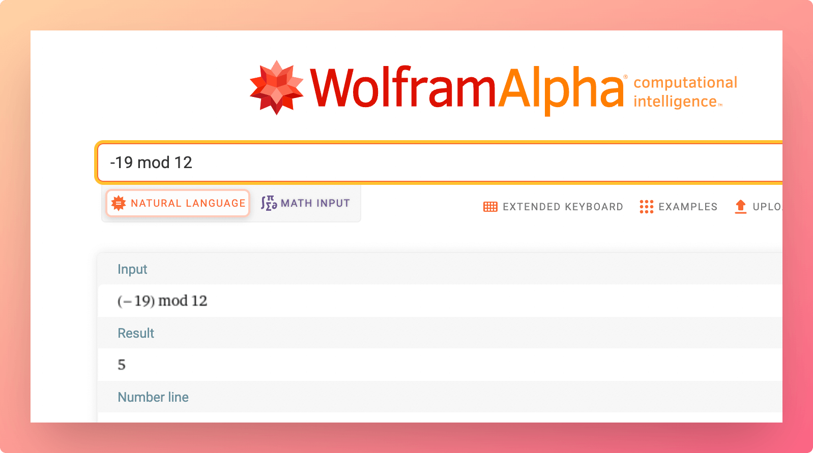
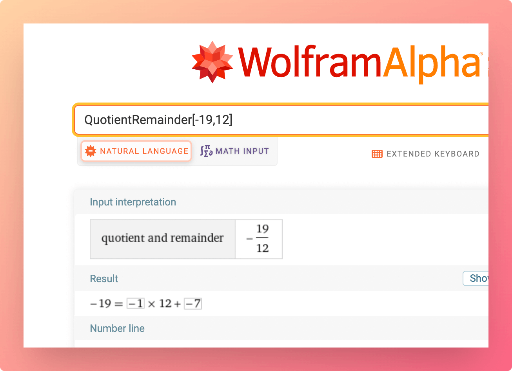

# mod

The **remainder (`%`)** operator allows you to get the **remainder** after dividing the first operand with the second operand.


```jsx
number % number
mod(number, number)
```


Notion provides a `mod()` function as well as `%` and `mod`operators (I'll just reference `%` for the rest of this article).&#x20;

Somewhat confusingly, these do not return a true modulus value; they return a remainder (see: [Remainder or Modulus?](mod.md#remainder-or-modulus) below).

As `%` and `mod()` output a remainder, their output values will take the sign (`+/-`) of the dividend.

For reference, the **dividend** is the number being divided by the **divisor**, which produces the **quotient**:

$$
\frac {dividend}{divisor} = quotient
$$

## Example Formulas


```jsx
19 % 12 // Output: 7

19 mod 12 // Output: 7

mod(-19,12) // Output: -7
```


### Negative Divisors

If the divisor is negative:

* `mod()` will treat it as a negative integer natively.
* if you're using the `%` operator, you'll need to wrap your divisor in parentheses `()` in order to explicitly define your divisor as a negative integer.
  * `x % (-y)` will work exactly like `mod().`
  * `x % -y` will cause Notion to rewrite your formula as `x / 100 - y`, which will output an incorrect result. This is because the `-` is treated as a unaryMinus operator, and Notion's math engine can't correctly deal with it when it's appended to the divisor.


```javascript
19 % (-12) // Output: 7

// Negative value passed via a property does not need to 
// be wrapped in () symbols

prop("negative num") == -12
19 % prop("negative num") // Output: 7

19 % -12 // Rewritten as 19 / 100 - 12, outputs -11.81

mod(19,-12) // Output: 7
```



Note: The above rules only apply if you're hard-coding a negative divisor in a formula. If you pass one via a property, it'll be parsed as a true negative value. It won't add a unaryMinus operator to your formula.


### Remainder or Modulus?

[Just as in JavaScript](https://developer.mozilla.org/en-US/docs/Web/JavaScript/Reference/Operators/Remainder), Notion’s `%` operator calculates the **remainder** of two numbers, not the **modulus.** Confusingly, the `mod()` function does this as well, despite its name.

The **remainder** and **modulus** of two numbers will be identical when both the dividend and divisor have the same sign (`+/-`). If their signs differ, however, the modulus will differ from the remainder.





You can prove this using WolframAlpha:

* `-19 mod 12` results in `5`
* `QuotientRemainder[-19,12]` results in `-7`

 

To calculate a true modulus in Notion, use `((x % y) + y) % y` instead:


```jsx
// Using the % operator
((19 % 12) + 12) % 12

// Using the mod() formula
mod(mod(19, 12) + 12, 12)

// % operator example using hard-coded negative divisors
((19 % (-12)) + (-12)) % (-12)
```



As noted above in the **Negative Divisors** section, hard-coded negative divisors in `%` expressions need to be wrapped in parentheses `()` so Notion can parse them explicitly as negative integers (see code line `7` in the above code block).&#x20;

Otherwise, Notion will interpret the `-` as a [unaryMinus](unaryminus.md) operator, rewrite your formula to `(x / 100 - y + -y) / 100 - y`, and return an incorrect result. However, this isn't necessary when using the `mod()` function.


<details>

<summary>Remainder vs. Modulo programming functions</summary>

I recommend reading Dr. Axel Rauschmayer's [Remainder Operator vs. Modulo Operator](https://2ality.com/2019/08/remainder-vs-modulo.html) article to fully understand this, but here's a summary.

To find a **remainder**, the formula is:

$$remainder  = dividend - divisor * quotient$$

In JavaScript, the `%` operator accomplishes this using the following function:


```javascript
// x == dividend, y == divisor
remainder = x - y * Math.trunc(x/y);
```


The [Math.trunc()](https://developer.mozilla.org/en-US/docs/Web/JavaScript/Reference/Global\_Objects/Math/trunc) function simply chops all of the decimals off of a number and returns only what was left of the decimal point. In more precise terms, it rounds a number towards zero, no matter how how the decimal point.


```javascript
Math.trunc(2.9) == 2
Math.trunc(-2.9) == -2
```


To put it another way, Math.trunc() acts like [Math.floor()](https://developer.mozilla.org/en-US/docs/Web/JavaScript/Reference/Global\_Objects/Math/floor) when its argument is positive, and acts like [Math.ceil()](https://developer.mozilla.org/en-US/docs/Web/JavaScript/Reference/Global\_Objects/Math/ceil) when its argument is negative. For reference:

* `Math.ceil()` rounds towards positive infinity
* `Math.floor()` rounds towards negative infinity

_Note:_ The `trunc()` function doesn't exist in Notion's formula editor, but you can create it with: `(prop("Num") >= 0) ? floor(prop("Num")) : ceil(prop("Num"))`&#x20;

The formula for finding a **modulus** is the same, with one major difference: it uses the `floor()` function instead of `trunc()`.


```javascript
// x == dividend, y == divisor
modulus == x - y * Math.floor(x/y);
```


When the dividend and divisor have the same sign, the results from both formulas will be the same.

But when they are opposite, these formulas return different results.

This happens because `trunc()` will always return an answer _one integer greater_ than `floor()` will when both have the same **negative** integer as their argument.


```javascript
Math.trunc(-2.9) == -2
Math.floor(-2.9) == -3
```


The difference causes different results in the overall modulus/remainder functions.

For fun, here's how you could manually create remainder and modulus functions in Notion without using `mod()`. Note how complicated the remainder code is due to Notion's lack of a `trunc()` function!


```javascript
// Remainder function
prop("Dividend") - prop("Divisor") * ((prop("Dividend") / prop("Divisor") >= 0) ? floor(prop("Dividend") / prop("Divisor")) : ceil(prop("Dividend") / prop("Divisor")))

// Modulus function
prop("Dividend") - prop("Divisor") * floor(prop("Dividend") / prop("Divisor"))
```


</details>

## Example Database

This example database shows the differing outputs of **remainder** and true **modulus** expressions.


### View and Duplicate Database



You can check these results here:



### "Remainder" Property Formula


```jsx
prop("Dividend") % prop("Divisor")
```


### "Modulus" Property Formula


```jsx
(prop("Dividend") % prop("Divisor") + prop("Divisor")) % prop("Divisor")
```


Instead of using hard-coded numbers, I’ve called in each property using the `prop()` function.

#### About the Author

 My name is Thomas Frank, and I'm a [Notion-certified](https://www.credly.com/badges/95fae13a-17bf-4b4a-a3d2-d58c8a3e6a2a/public\_url) writer, YouTuber, and template creator. I've been using Notion since 2018 to organize my personal life and to run my business and YouTube channel. In addition to this formula reference, I've created a [free Notion course for beginners](https://thomasjfrank.com/fundamentals/) and several [productivity-focused Notion templates](https://thomasjfrank.com/templates/). If you'd like to connect, [follow me on Twitter](https://twitter.com/TomFrankly).
